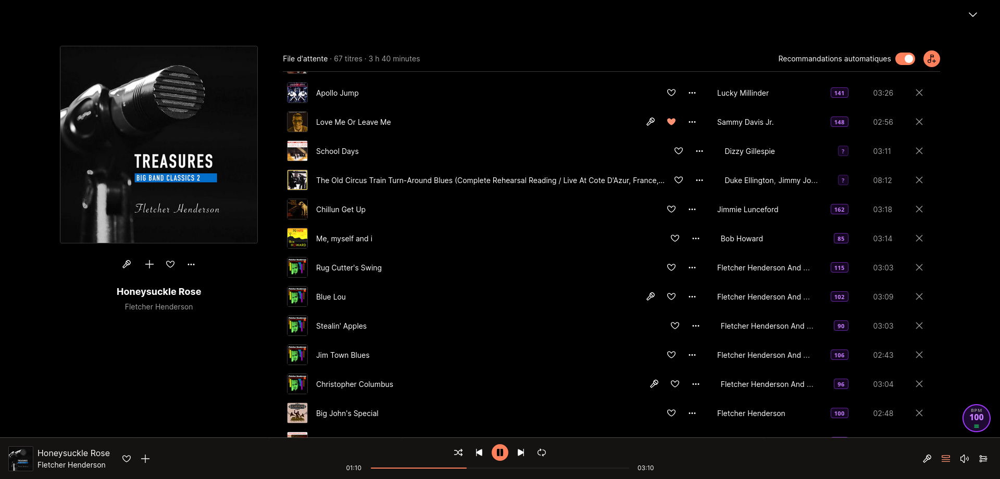

# Deezer BPM

A browser extension for Firefox and Chrome that displays the BPM of songs on [Deezer](https://www.deezer.com).

## Features

- **Floating badge** — shows the BPM of the currently playing track in a fixed badge at the bottom-right of the page
- **Playlist mode** — shows the BPM next to each track in a playlist or album view, loaded lazily as you scroll
- **BPM Selection & Filtering** — select and filter tracks by BPM range using expressions like `>120` or `124`
- **Persistent preference** — playlist mode and other settings are remembered across sessions
- **Localized** — UI available in English and French

## Screenshots



## Installation

### From a release (recommended)

**Firefox**
1. Download the latest `.xpi` file from the [Releases](../../releases) page
2. Open Firefox and go to `about:addons`
3. Click the gear icon → **Install Add-on From File…**
4. Select the downloaded `.xpi`

**Chrome**
1. Download the latest `.zip` file from the [Releases](../../releases) page
2. Unzip it
3. Open Chrome and go to `chrome://extensions`
4. Enable **Developer mode** (top-right toggle)
5. Click **Load unpacked** and select the unzipped folder

### From source

1. Clone the repository
   ```bash
   git clone https://github.com/octogene/deezer-bpm.git
   ```
2. Open Firefox and go to `about:debugging`
3. Click **This Firefox** → **Load Temporary Add-on…**
4. Select `deezer-bpm/manifest.json`

> **Note:** Temporary add-ons are removed when Firefox restarts. Use the signed `.xpi` for a permanent installation.

## Usage

1. Navigate to [deezer.com](https://www.deezer.com) and play a track
2. A small circular **BPM badge** appears at the bottom-right of the page
3. To show BPM for every track in a playlist or album, click the **≡** button on the badge
   - The button turns **bold green** when playlist mode is active
   - BPM values appear next to the track duration column and load as you scroll
4. To filter or select tracks by BPM, click the **filter icon** on the badge
   - Enter an expression: `>120` (greater than 120), `<=90` (less or equal to 90), `120-130` (range), or `124` (exact match)
   - Matching tracks are highlighted and automatically checked in the playlist

## How it works

BPM data is fetched from the public [Deezer API](https://developers.deezer.com/api) (`/track/{id}`) — no API key required.

For playlist mode, the extension fetches the full track list from the API (`/playlist/{id}/tracks` or `/album/{id}/tracks`) and maps each visible row using Deezer's virtual list `aria-rowindex` attribute. Results are cached for the session so tracks are never fetched twice.

## Development

The extension is a plain WebExtension (Manifest V3) with no build step.

```
deezer-bpm/
├── manifest.json
├── content/        # content script modules
├── styles.css      # badge and inline BPM tag styles
├── _locales/       # internationalization support
└── icons/          # extension icons
```

To work on it locally, load it as a temporary add-on (see [From source](#from-source) above). After editing a file, click **Reload** in `about:debugging`.

### Linting

We use ESLint to maintain code quality. To run the linter:

```bash
npm install
npm run lint:js
```

## Documentation

For more details on how the extension works and a full FAQ, visit the official documentation at [octogene.github.io/deezer-bpm](https://octogene.github.io/deezer-bpm/).

## Publishing a release

The CI workflow builds and signs the extension automatically when a version tag is pushed:

```bash
git tag v1.0.0
git push origin v1.0.0
```

This requires two repository secrets to be set (**Settings → Secrets → Actions**):

| Secret | Description |
|---|---|
| `AMO_API_KEY` | AMO JWT issuer key |
| `AMO_API_SECRET` | AMO JWT secret |

Generate them at [addons.mozilla.org/developers/addon/api/key](https://addons.mozilla.org/developers/addon/api/key).

## License

MIT
